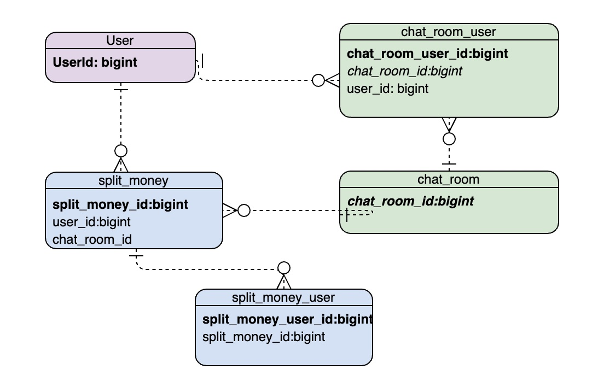

# Split Money

## 로컬 환경 구성
### Requirements
- MySQL 5.7
- JDK 8

**MySQL Docker Continaer 실행**
```
./run-local.sh
```

## Used
- Spring Boot 2.2.8.RELEASE
- Gradle 4+
- JUnit5

## Package Structure
```
homework
└───config 
└───controller
└───datasource
│   └───entity
│   └───repository
└───dto
└───exception
└───filter
└───service
└───util
│   Application.java
```
Main
## API 명세
|Method|URI|Description|
|------|---|---|
|POST|/api/v1/split-money|유저가 대화방 유저들에게 돈을 뿌릴 수 있는 API|
|POST|/api/v1/split-money/receive|대화방의 유저가 돈을 받을 수 있는 API|
|GET|/api/v1/split-money|돈을 뿌린 유저의 조회 API|

## DB Entity


## HTTP Method
- GET / POST 만 사용하며 모두 동사를 포함하여 사용한다.

## Error Response
에러 발생 시 Response Body엔 아래와 같이 내려간다.
```$xslt
{
    "code" : 500, // HttpStatus.code
    "message" : "Invalid Token" // Exception Message
}
```
- 정의된 실패의 경우 HttpStatus.BAD_REQUEST
- 그 외 에러의 경우 HttpStatus.INTERNAL_SERVER_ERROR 로 구분한다.
